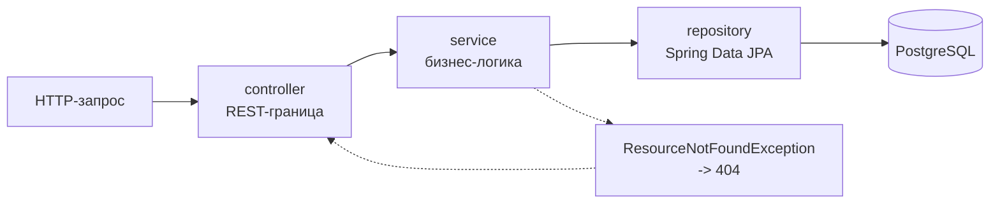

# Bug Collection

> **Maintenance status · 2026-08-25: HOBBY, 0 committed portfolio hours.** Текущий код —
> coursework baseline для спокойного Java revival в свободном таймбоксе; проект не имеет
> карьерного SLA и не конкурирует с активными P1/P2.

   

REST-сервис каталога коллекций жуков на Java и Spring Boot: пользователи, экземпляры,
предложения обмена. Исходная версия сервиса, позже переписанная на Kotlin —
см. [beetle-management-service](https://github.com/m4themagics/beetle-management-service).

**Стек:** Java · Spring Boot · Spring Data JPA · Hibernate · PostgreSQL · Maven

## Архитектура

Трёхслойное разделение с интерфейсами между слоями:

```text
controller/    BeetleController — REST-эндпоинты
service/       BeetleService, UserService + реализации в Impl/
repository/    BeetleRepository, UserRepository — Spring Data JPA
model/         Beetle, User, ExchangeOffers — сущности
ResourceNotFoundException    отдельный тип для 404
```

`src/main/resources/query.sql` содержит исходные запросы, по которым проектировалась схема.

## Поток запроса



Каждый слой обращается только к соседнему снизу и знает его как интерфейс, а не как
реализацию — поэтому хранилище можно подменить, не трогая контроллеры.

## Запуск

Нужны JDK 17+ и PostgreSQL с базой `BugCollection`.

```bash
./mvnw spring-boot:run
```

Параметры подключения — в `src/main/resources/application.properties`; подставьте свои
учётные данные. Таблицы создаются автоматически (`ddl-auto=update`).

## Kotlin-версия

Тот же сервис на Kotlin, Gradle и с метриками Prometheus:
[beetle-management-service](https://github.com/m4themagics/beetle-management-service).
Репозитории удобно смотреть рядом — видно, что именно меняется при переносе
Spring-приложения с Java/Maven на Kotlin/Gradle.

## Возможное hobby-продолжение

Желаемая идея — сохранить Java-репозиторий основным и постепенно превратить каталог в
сервис рекомендаций для обмена коллекционными объектами. Это не текущий roadmap и не
обещание для резюме. Порядок допуска к работе:

1. **Foundation:** Java 21, DTO вместо выдачи JPA entities, Bean Validation,
   `@RestControllerAdvice`, Flyway, BCrypt или удаление фиктивного пароля, PostgreSQL через
   Testcontainers, интеграционные тесты, Docker Compose и CI.
2. **Завершённый продуктовый срез:** wishlist, создание/просмотр/принятие/отклонение
   exchange offers, история взаимодействий и rule-based top-K по взаимной совместимости.
3. **Только после рабочего API:** события Kafka и Java/Flink-признаки; Redis, ML ranking и
   Python/ONNX serving — отдельные необязательные эксперименты с собственным stop/go.

Kotlin-версия при этом остаётся историческим экспериментом и не развивается параллельно.
